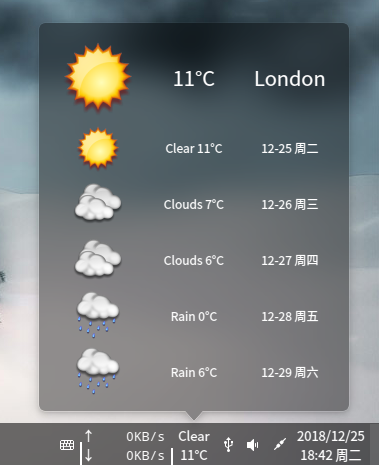
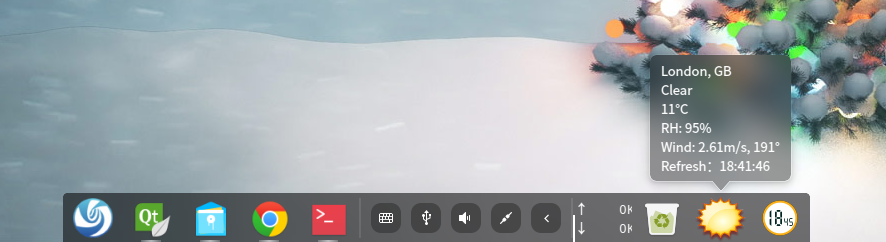

# DDE_Dock_Weather

This is a fork from [sonichy](https://github.com/sonichy/WEATHER_DDE_DOCK) with theme options feature. 

Deepin Linux DDE-Dock weather forcast plugin.  
[Releases](../../releases/)  
install：./install.sh  
uninstall：./uninstall.sh  
  
  
### 5.0 (2018-12-19)
* Change API to https://openweathermap.org to support world wide weather forcast.
